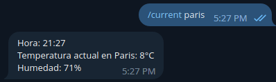

# Telegram Bot Readme
[](https://github.com/faculerena/telegrambot/actions/workflows/go.yml)
[](https://github.com/faculerena/telegrambot/actions/workflows/deploy.yml)

This is a Telegram bot that can provide current weather information and memes.

## Weather Functionality

_(The default [city] is Buenos Aires)_

To get current weather information for a specific city, use the following command:

```
/current [city]
```



To get the forecast for the next 3 days, use the following command:

```
/nextdays [city]
```


The bot will respond with the forecasted weather conditions for the next 3 days for the specified city.


## Meme Functionality

To generate a handshake meme, use the following command:

```
/handshake a - b - c
```

You can replace "a", "b", and "c" with any words or phrases of your choosing to create a custom meme. The bot will respond with the handshake meme featuring your chosen words.

Example:

```
/handshake foo - bar - foobar
```

returns:


# More Info

This bot can be accessed at @hourlyweathercaba_bot in telegram. It's hosted in Fly.io using permanent storage to open and send the photos.

# To Do

- Adding verification to view logs in telegram.
- Adding more memes to a weather bot? probably.
- Caching the "forecast" to avoid multiple identical calls to the weather API


